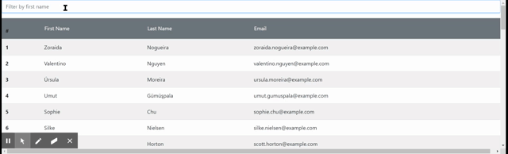

# React Employee Directory

## Table of Contents :book:

- [Description](#description)
- [User Story](#user-story)
- [Installation](#installation)
- [Usage](#usage)
- [License](#license)
- [Contribute](#contribute)
- [Tests](#tests)
- [Questions](#questions)

## Description  :page_facing_up:

This app utilizes the randomuser api to grab a random set of 50 people that we will refer to as employees. The app is broken down into 4 components and utilizes hooks to pass information between these components. Filtering reduces the number of results based on the first name column and sorting will allow for any column to be sorted in ascending or descending order.

## User Story  :woman:

As an employer, I want a way to sort and filter my employees, so that I may find quickly find their contact information.

## Installation  :floppy_disk:

The app is hosted using github pages [here](https://brians-123.github.io/react-employee-directory/)

## Usage  :computer:

Go to the app hosted [here](https://brians-123.github.io/react-employee-directory/). Filter the list by typing into the filter and sort by clicking on the header buttons. Below is a gif of the functionality: 

## License  :copyright:

This application is covered under the None license.

## Contribute  :heavy_plus_sign: :heavy_plus_sign:

Do not contribute to this project

## Tests  :microscope:

No tests were created for this project

## Contact  :email:

[github account](https://github.com/brians-123)
